# Watershed Segmentation for MRI Brain Tumours

A **from-scratch implementation of the watershed transform** applied to brain-tumour
segmentation in T1-weighted contrast-enhanced MRI. It covers plateau-aware regional
minima, priority-queue flooding, minima imposition and marker extraction.

Two complete pipelines are compared:

| | **Classic** | **Medical (adaptive Otsu)** |
|---|---|---|
| Pre-processing | none | CLAHE + Gaussian smoothing (σ = 1) |
| Flood surface | Sobel gradient of the slice | Sobel gradient of the enhanced slice |
| Markers | size-filtered regional minima of the gradient, inside the brain | quadtree split-merge regions → per-region Otsu edge map → morphology → scalp-ring removal |
| Segmentation | marker-controlled watershed (bucket queue) | same |
| Tumour selection | basin with the best IoU vs. ground truth (Otsu vote without GT) | same |

*Image Processing term project by AmirHossein Mokabberi, 2026.*

---

## Results

Slice 1 of the dataset (meningioma):

<table>
  <tr>
    <th>MRI slice</th><th>Ground truth</th>
  </tr>
  <tr>
    <td>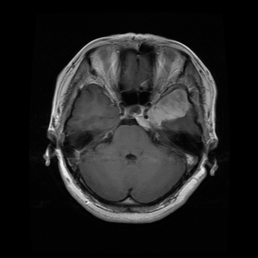</td>
    <td>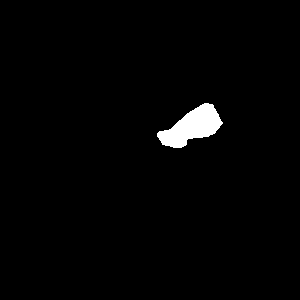</td>
  </tr>
</table>

<table>
  <tr>
    <th></th><th>Gradient</th><th>Markers</th><th>Basins</th><th>Watershed lines</th><th>Predicted tumour</th>
  </tr>
  <tr>
    <th>Classic</th>
    <td>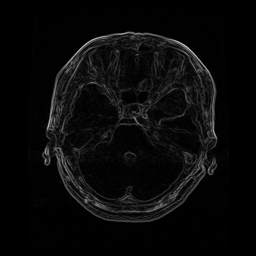</td>
    <td>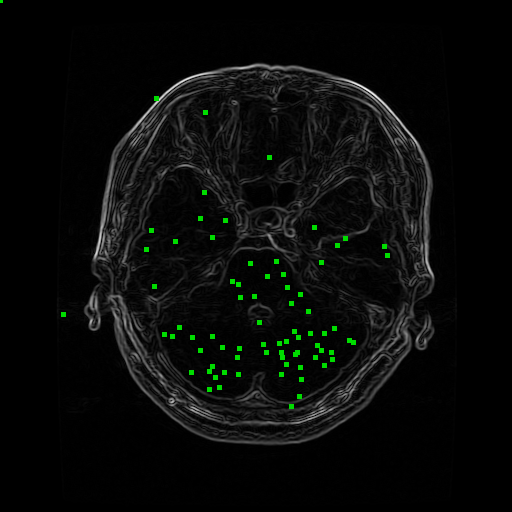</td>
    <td>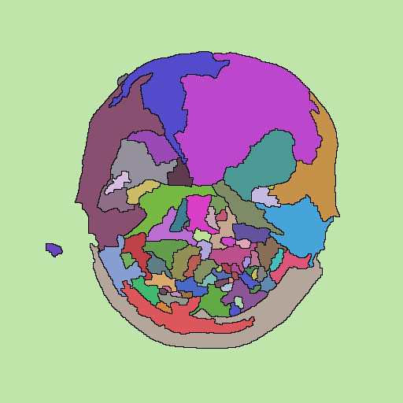</td>
    <td>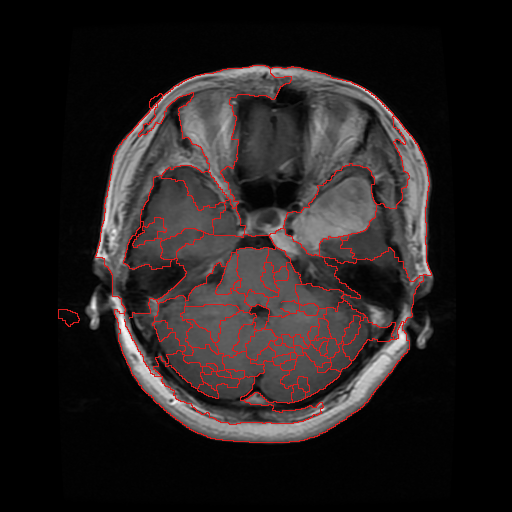</td>
    <td>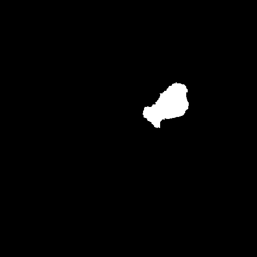</td>
  </tr>
  <tr>
    <th>Medical</th>
    <td>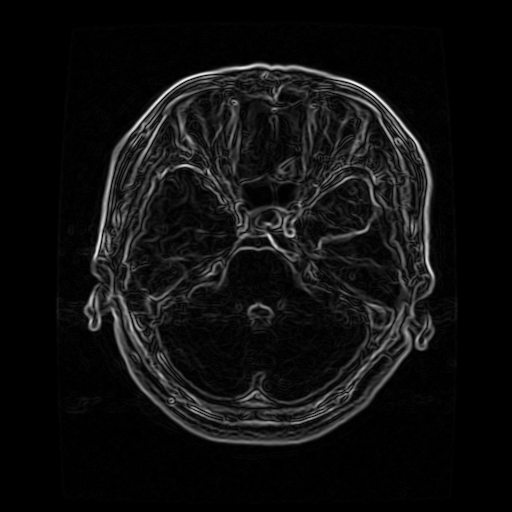</td>
    <td>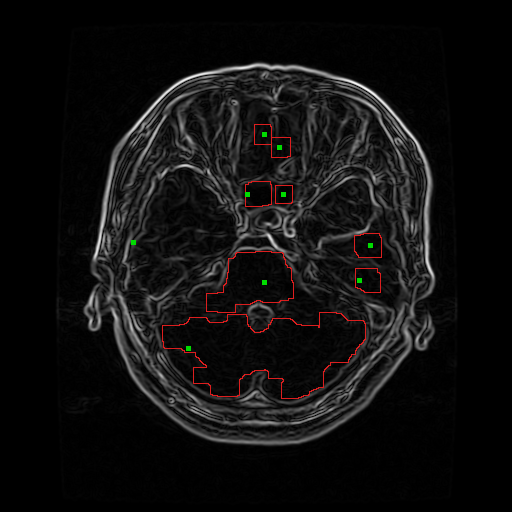</td>
    <td>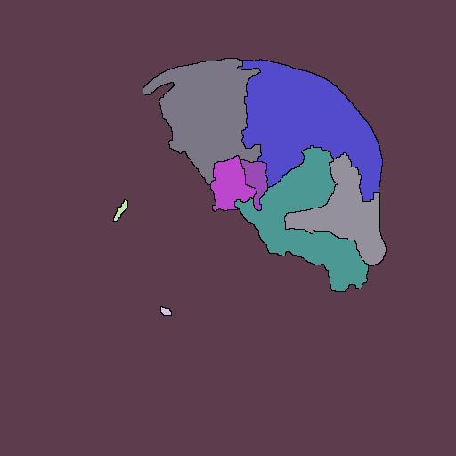</td>
    <td>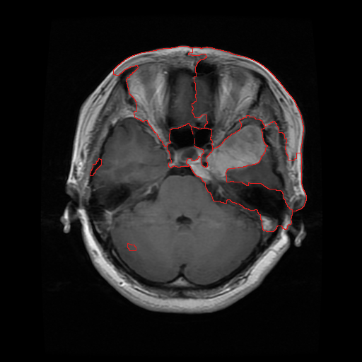</td>
    <td>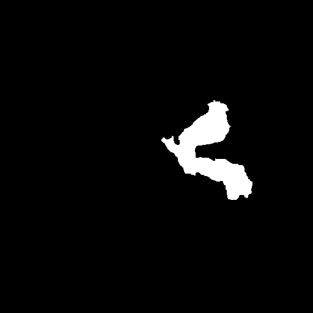</td>
  </tr>
</table>

Markers are green; in the medical pipeline the red rings are the closed edge contours
that the markers are extracted from.

**Tumour IoU on the three sample slices** (best single basin vs. expert mask):

| Slice | Classic: basins | Classic: IoU | Medical: basins | Medical: IoU |
|:-----:|:---------------:|:------------:|:---------------:|:------------:|
| 1 | 76  | **0.736** | 9  | 0.435 |
| 2 | 96  | 0.367 | 10 | **0.491** |
| 3 | 188 | **0.405** | 16 | 0.051 |
| **mean** | | **0.503** | | 0.326 |

**Observations**

- The medical marker extraction cuts the number of basins by roughly 10×. That removes
  most of the over-segmentation, but the basins are coarser, so a tumour that shares a
  basin with healthy tissue can no longer be isolated.
- On slice 3 the selected medical basin merges the tumour with the region outside the
  skull, which gives an IoU of only 0.05. The classic pipeline is more robust here
  because its many small basins still contain one that follows the tumour.
- The tumour is chosen as the basin that best overlaps the ground truth. This is an
  *oracle* selection: it measures how well the segmentation *can* isolate the tumour,
  not fully automatic detection. Without a mask, the pipeline falls back to a
  per-basin Otsu brightness vote.

All output images are in [`results/classic`](results/classic) and
[`results/medical`](results/medical).

---

## How it works

The gradient magnitude image is read as a topographic relief: edges are ridges and
homogeneous tissue forms valleys.

1. **Regional minima** (`find_regional_minima`): BFS over each plateau of equal
   value. A plateau with no strictly lower neighbour is a minimum.
2. **Flooding** (`watershed_from_scratch`): every minimum gets a basin ID. Pixels are
   popped from a min-priority queue in increasing order of height. A pixel joins a basin
   when exactly one basin touches it; if two or more touch it, it becomes a
   **watershed (dam) pixel**.
3. **Over-segmentation**: on a real gradient every tiny noise minimum becomes its own
   basin.
4. **Minima imposition** (`impose_minima`): the gradient is modified so that its only
   minima are at chosen *markers*. Valleys without a marker are filled up to their
   spill level, while ridges are kept.
5. **Marker-controlled watershed** (`marker_watershed_image`): the modified gradient is
   flooded from the markers only, giving one basin per marker. A 256-level bucket queue
   makes this O(1) per pixel on uint8 images.

The medical pipeline improves the markers. **Quadtree split-and-merge** splits the
image into homogeneous regions. It uses a union-find with running mean/variance
statistics, so every merge test is O(1). Each region then gets its **own Otsu
threshold** on the gradient, which picks up weak edges in dim tissue as well as
strong ones. Morphological closing turns this edge map into closed contours, and each
enclosed region becomes one marker.

Run `python toy_demo.py` to see every step printed on small hand-made surfaces.

**What is implemented from scratch:** regional minima and maxima, heap and bucket-queue
flooding, minima imposition, Gaussian smoothing, quadtree split-merge, per-region
thresholding, marker extraction and tumour selection.
**Library calls:** Sobel filter, binary morphology and connected-component labelling
(SciPy), and the Otsu threshold value and CLAHE (scikit-image).

---

## Getting started

Requires Python 3 (tested with Python 3.12). Clone or download this repository, then
install the dependencies:

```bash
pip install -r requirements.txt
```

```bash
python toy_demo.py        # step-by-step demo on tiny surfaces (console)
python run_pipeline.py    # both pipelines on the 3 sample slices -> results/
```

Options:

```bash
python run_pipeline.py --method classic             # or: medical, both (default)
python run_pipeline.py --data path/to/pngs --out out --limit 20
```

For every `<n>_image.png` in the data folder, with an optional `<n>_mask.png` ground
truth next to it, the pipeline writes `<n>_gradient`, `<n>_markers`, `<n>_segments`,
`<n>_boundaries` and `<n>_pred_mask` to `<out>/<method>/` and prints an IoU summary.
The code is pure Python, so each slice takes a few seconds.

### Full dataset

Only three sample slices are included. To run the pipeline on all 3,064 slices:

1. Download the dataset from figshare:
   <https://doi.org/10.6084/m9.figshare.1512427>. It comes as several zip parts.
2. Extract every `.mat` file into `data/mat/`.
3. Convert them to PNG:
   ```bash
   python tools/mat_to_png.py              # -> data/png/ + data/dataset_metadata.csv
   ```
4. Run the pipeline on them:
   ```bash
   python run_pipeline.py --data data/png --limit 50
   ```

---

## Project structure

```
.
├── run_pipeline.py            # MRI pipelines (classic / medical) — main entry point
├── toy_demo.py                # step-by-step console demo on tiny surfaces
├── watershed/                 # the from-scratch implementation
│   ├── core.py                #   regional minima, flooding (heap / bucket queue), minima imposition
│   ├── preprocessing.py       #   Gaussian smoothing, CLAHE, Sobel gradient
│   ├── markers.py             #   seed extraction: gradient minima, split-merge + adaptive Otsu
│   ├── tumour.py              #   tumour-basin selection, IoU
│   └── visualize.py           #   basin colouring, overlays, mask export
├── tools/
│   └── mat_to_png.py          # convert the figshare .mat files to PNG
├── data/samples/              # 3 example slices + expert tumour masks
└── results/                   # pipeline outputs for the sample slices
    ├── classic/
    └── medical/
```

---

## Dataset and citation

The MRI slices come from the **figshare brain tumor dataset**: 3,064 T1-weighted
contrast-enhanced slices from 233 patients (708 meningioma, 1,426 glioma and 930
pituitary tumour slices), each with an expert tumour mask. It is licensed under
[CC BY 4.0](https://creativecommons.org/licenses/by/4.0/). The three sample slices in
`data/samples/` are slices 1–3 of that dataset, converted to PNG.

> Jun Cheng, *brain tumor dataset*, figshare, 2017.
> https://doi.org/10.6084/m9.figshare.1512427.v5
>
> J. Cheng et al., "Enhanced Performance of Brain Tumor Classification via Tumor Region
> Augmentation and Partition," *PLoS ONE* 10(10): e0140381, 2015.

## License

The code is released under the [MIT License](LICENSE). The dataset keeps its own
CC BY 4.0 license.
